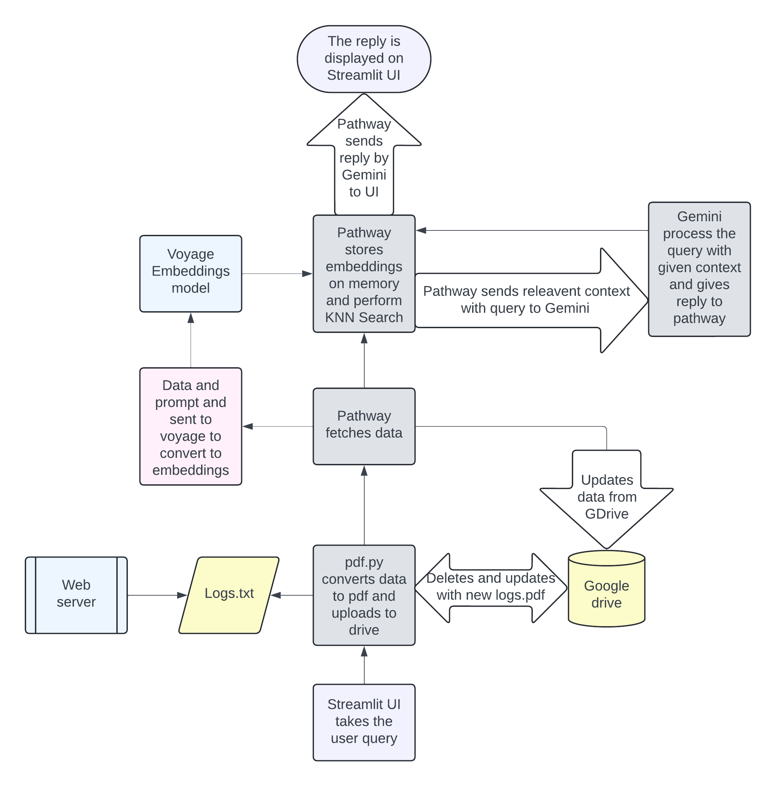

<h1 align="center">
  Logs_Search
</h1>

## Key Features

- **Up to date logs**: Logs are updated at the time time of user query to decrease the load on server with real-time updation.
- **Future Integration**: Plans to incorporate the Wolfram API, enabling AURA to tackle complex mathematical problems.
- **User-Friendly UI via Streamlit**: App comes equipped with an intuitive, Streamlit-powered interface.This sleek, user-friendly UI simplifies navigation.
- **Code Reusability**: The code is reusable and all modules are independent of each other.


## Methodolgy
<p align="center">
  
</p>

- **User Enters Query**:
    - User enters the query thorugh the streamit ui and when its submitted,it executes pdf.py.
    - After pdf.py is execeuted query is sent to [pathway llm app](https://github.com/pathwaycom/llm-app). 
 
- **Data Sources**:
    - Data is logged by server using its logging service or third party logging service.
    - Django has its own logging service.Logs are written to a textfile.
    - Pdf.py contacts the server and retrive its logs and convert it into pdf each time user enter a query to get upto date logging info. 
    - Existing pdf file in drive is deleted and new one is uploaded everytime pdf.py runs as to prevent data exhaustion in G Drive.Converted to pdf because GDrive connector dont support textfiles.

- **Streaming Pipeline**:
    - The incoming data from these sources is processed and after processing, the data is split into smaller chunks. This is necessary because it’s often more efficient to work with smaller pieces of text when performing NLP tasks. The changes in data are automatically synced to the pipeline enabling real-time Retrieval Augmented Generation (RAG) using llm-app .

- **Embedding**:
    - These chunks are then embedded into a vector space using an Voyage embedding model. Embedding converts text data into numerical vectors that capture the semantic meaning of the text. 

- **KNN Vector Indexing**:
    - The numerical vectors are indexed using a KNN (k-nearest neighbors) algorithm. In used to quickly retrieve the most relevant text chunks in response to a query based on vector similarity. The llm app is reactive to changes to the corpus of documents: once new snippets are provided, it reindexes them and starts to use the new knowledge to answer subsequent queries. This technique is significantly faster and more efficient than conducting individual comparisons between the query and every document.

- **Integration of User Query and Knowledge Base**:
    - The embedded user query is then used to perform a KNN search in the vector index to find the most relevant chunks of embedded data from the processed sources.
    - This combination of user query embeddings and indexed data allows the system to understand and retrieve information that is contextually relevant to the user's question.

- **Response Generation**:
    - The Gemini LLM (Large Language Model), uses the retrieved information to generate an appropriate response.
    - The response generation is likely informed by a prompt template, which structures how the model should incorporate the information into a coherent reply.
    - The generated response is displayed to the user on streamlit ui. 


## Installation
Installation is of two part Part A and Part B.
Part A is setting up of Pathway LLM App for backend.
Part B is running Logs_Search App. 
### A. Setting up Pathway LLM App for Backend 

### Prerequisites

Ensure you have Docker and docker compose both latest version installed on your system before proceeding. Docker compose  will be used to build and run the application in a containerized environment. For installation please refer the offcial documneation of docker [Docker Installation Guide](https://docs.docker.com/compose/install/linux/)


- **Gemini API Key**:
    - Gemini Pro is used as LLM model you can use other LLM models if you do that you may have to change the geminiapi_helper.py file a bit please refer this documentation.[How to use different LLMs in Pathway](https://pathway.com/developers/api-docs/pathway-xpacks-llm/llms/#pathway.xpacks.llm.llms.LiteLLMChat)
   -  You can obtain your [Gemini Pro API Key](https://ai.google.dev/gemini-api/docs/api-key) here.
- **Google Drive Storage**:
    - Certain Json files are needed to authenicate our application with google drive to access it files.
    - Please refer this link to know more [Connect Pathway LLM App with GDrive](https://pathway.com/developers/user-guide/connectors/gdrive-connector#setting-up-google-drive)
- **Voyage API Key**:
    - Create an [Voyage](https://www.voyageai.com/) account and generate a new API Key: 
    - To access the Voyage API, you will need to create an API Key. You can do this by logging into the [Voyage Dashboard](https://dash.voyageai.com/) and navigating to the API Key management page.


### 1. Environment Setup

1. Create a `.env` file in the root directory of your project.
2. Add the following lines to the `.env` file, replace with you API keys:

   ```env
   GEMINI_API_KEY="Enter your gemini api key here"
   VOYAGE_API_KEY="Enter your voyage api key here"
   EMBEDDING_DIMENSION=1024
   LOCAL_FOLDER_PATH='/Desktop/dockercontainers'
   ```

This file will be used by Docker to set the environment variables inside the container.

### 2. Build and Run the Docker Image

With the environment variables set up, you can now build the Docker and run the image for the project.

- Open a terminal or command prompt.
- Navigate to the root directory of your project.
- Execute the following command to build and run the docker:

  ```sh
  docker-compose up
  ```
  This step compiles your application and its dependencies into a Docker image.
  - If you change some code after you have build a docker container once you have use following command:
  ```sh
  docker-compose build && docker-compose up
  ```
  This command will remake the container with the changes made or else the docker will use the conatiner made eariler
  without any changes made
   

### 3. Troubleshooting

If you encounter any issues during the setup or execution process, please check the following:

- Ensure Docker is running on your system.
- Verify that the `.env` file contains the correct API key and settings.
- Make sure the Docker image was built successfully without errors.
- Check if the Docker container is running and the ports are correctly mapped.

For further assistance, consult the Docker documentation or seek help from Docker community forums.

### B. Running Logs_Search App

### Setting Up the streamlit ui and logs uploading script


1. Create a new python virtual environment:

    ```bash
     python -m venv nameofthevirtualenviroment 
    ```

    Replace `myenv` with a name of your choice for the Conda environment.

2. Install dependencies
   ```
   pip install -r requirements2.txt
   ```

3. Activate the newly created Conda environment:
    -Note the following command will only on command prompt and not on powershell
    ```bash
    nameofthevirtualenviroment\scripts\activate
    ```

4. Launch the Streamlit UI:

    ```bash
    streamlit run ui.py
    ```
  - Open your web browser.
  - Navigate to `http://192.168.29.123:8501/` to access the application.Accessing with localhost may not work as docker is running on localhost and may create conflict for connecting with docker


